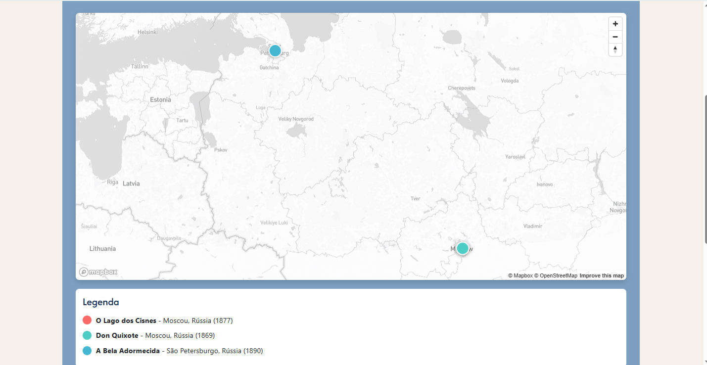
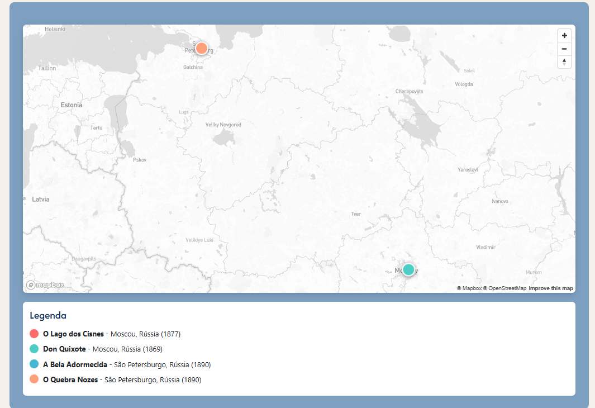

# Trabalho Prático 07 - Semanas 13 e 14

A partir dos dados cadastrados na etapa anterior, vamos trabalhar formas de apresentação que representem de forma clara e interativa as informações do seu projeto. Você poderá usar gráficos (barra, linha, pizza), mapas, calendários ou outras formas de visualização. Seu desafio é entregar uma página Web que organize, processe e exiba os dados de forma compreensível e esteticamente agradável.

Com base nos tipos de projetos escohidos, você deve propor **visualizações que estimulem a interpretação, agrupamento e exibição criativa dos dados**, trabalhando tanto a lógica quanto o design da aplicação.

Sugerimos o uso das seguintes ferramentas acessíveis: [FullCalendar](https://fullcalendar.io/), [Chart.js](https://www.chartjs.org/), [Mapbox](https://docs.mapbox.com/api/), para citar algumas.

## Informações do trabalho

- Nome: Ana Júlia de Sena Oliveira
- Matricula:
- Proposta de projeto escolhida: Site sobre Ballet Clássico - En Pointe
- Breve descrição sobre seu projeto: Site dedicado ao ballet clássico, apresentando informações sobre espetáculos, figuras icônicas e a história do ballet.

## Implementação - Visualização com Mapbox

### Descrição da Implementação

Foi implementada uma página de visualização interativa utilizando a biblioteca **Mapbox GL JS** para exibir em um mapa os lugares de origem dos espetáculos de ballet cadastrados no sistema.

**Funcionalidades implementadas:**

1. **Página de Mapa (`mapa.html`)**:
   - Integração com Mapbox GL JS v2.15.0
   - Mapa interativo com estilo claro (light-v11)
   - Controles de navegação (zoom, rotação)

2. **Marcadores Dinâmicos**:
   - Cada espetáculo é representado por um marcador colorido no mapa
   - Marcadores posicionados nas coordenadas geográficas (latitude/longitude) dos teatros de estreia
   - Popups informativos ao clicar nos marcadores, contendo:
     - Nome do espetáculo
     - Teatro de estreia
     - Cidade e país
     - Ano de estreia
     - Link para página de detalhes

3. **Integração com CRUD**:
   - Dados carregados dinamicamente da API JSON Server
   - Suporte a adicionar, editar ou remover espetáculos via CRUD
   - Mapa atualiza automaticamente quando novos espetáculos são adicionados

4. **Legenda Interativa**:
   - Legenda exibindo todos os espetáculos com suas respectivas cores
   - Cores únicas para cada espetáculo facilitam a identificação

5. **Ajuste Automático de Zoom**:
   - O mapa ajusta automaticamente o zoom para mostrar todos os marcadores
   - Padding adequado para melhor visualização

**Dados de Localização Adicionados:**
- O Lago dos Cisnes: Teatro Bolshoi, Moscou, Rússia (1877)
- Don Quixote: Teatro Bolshoi, Moscou, Rússia (1869)
- A Bela Adormecida: Teatro Mariinsky, São Petersburgo, Rússia (1890)

**Biblioteca Utilizada:**
- Mapbox GL JS v2.15.0
- CDN: https://api.mapbox.com/mapbox-gl-js/v2.15.0/mapbox-gl.js

**Print da tela com a implementação**

### Tela 1: Mapa com todos os espetáculos

Esta tela mostra o mapa interativo com todos os espetáculos cadastrados. Cada marcador colorido representa um espetáculo diferente, e ao clicar em um marcador, é exibido um popup com informações detalhadas.

### Tela 2: Mapa após adicionar novo espetáculo via CRUD

Esta tela demonstra a funcionalidade dinâmica do mapa. Após adicionar um novo espetáculo através da página de administração (CRUD), o mapa é atualizado automaticamente com o novo marcador, demonstrando a integração completa entre o sistema de gerenciamento de dados e a visualização.

